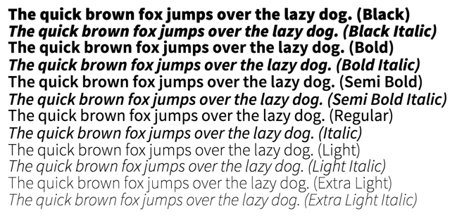

Source Sans Pro WebFont
======================

[Source Sans Pro](http://www.fontsquirrel.com/fonts/source-sans) font by _Paul D. Hunt_ 
converted to a Web Font with the Font Squirrel WebFont generator.

> Source Sans Pro was designed by Paul D. Hunt as Adobe’s first open source typeface family, conceived primarily as a typeface for user interfaces. Source Sans Pro draws inspiration from the clarity and legibility of twentieth-century American gothic typeface designs. Distilling the best archetypical qualities of these models, Paul followed a rational design approach by simplifying glyph shapes by paring them to their essential form. However, in order to more easily differentiate similar letter shapes (such as uppercase I and lowercase L), some additional details have been added. Besides providing such explicitly clarity in short text strings, another fundamental design consideration was to create a typeface that reads well in extended settings. This can be seen in the general proportions: Source Sans Pro has been designed with a more generous width than many other comparable gothics, and its shorter majuscule letters, combined with minuscule letters with longer extenders, create a more pleasant reading texture in longer text passages.

Example
-------



[Font Specimen demo](./demo.html)

Usage
-----

To install in a Bower project

```
bower install --save git+ssh://git@git.ozoux.com/fonts/sourcesans.git
```

Then add the `font-sourcesans/font.css` file to your project
